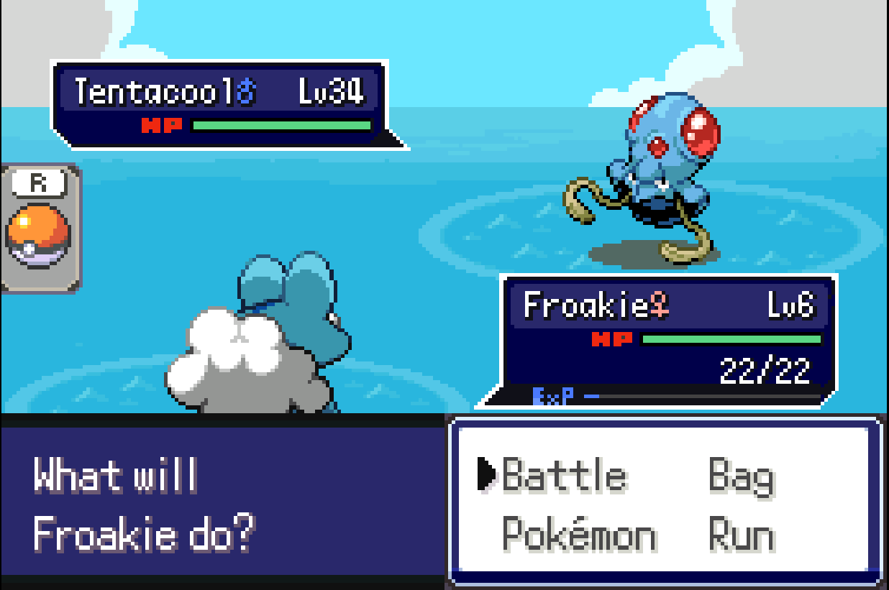
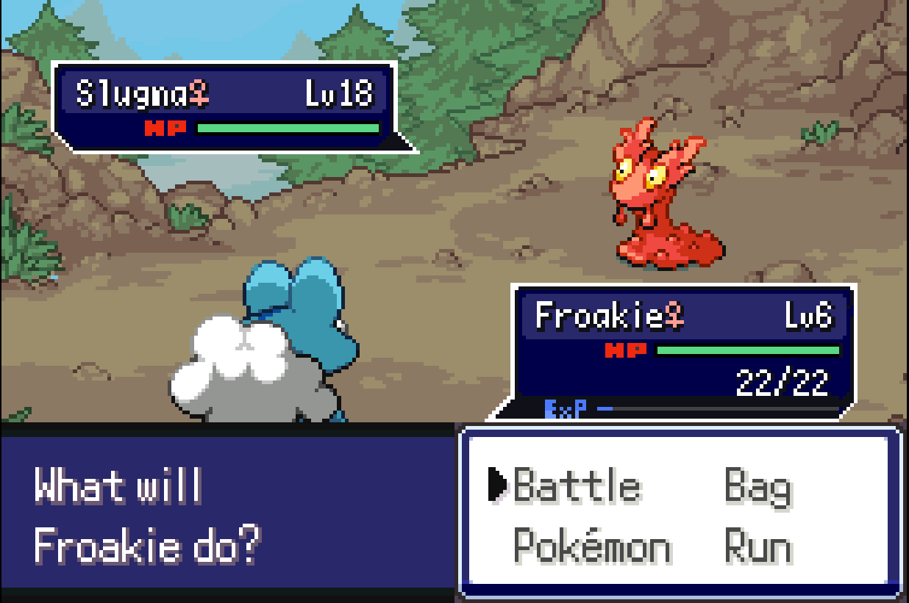
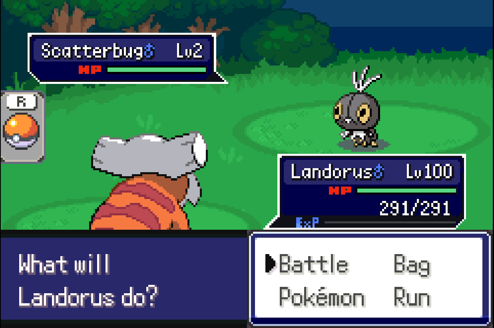

Battle backgrounds from CFRU. All images are indexed and ready to be used.
See guide on how to use these.
https://www.pokecommunity.com/threads/fully-editing-an-existing-battle-background.455366/

If you want to use morning and night palettes, you'll need to do some adjustments. See this commit's battle_bg.c/h related changes for reference.
https://github.com/Eemeliri/pokeemerald-expansion/commit/7b659f97941e22e48e537e9edd6b1de604ec9be0#diff-fdcb4295b9dca08a1484c33548c19eaf38f9a47a8f06d949e67d16d4b8c3d765

Included some bins ready to be used for emerald too.

