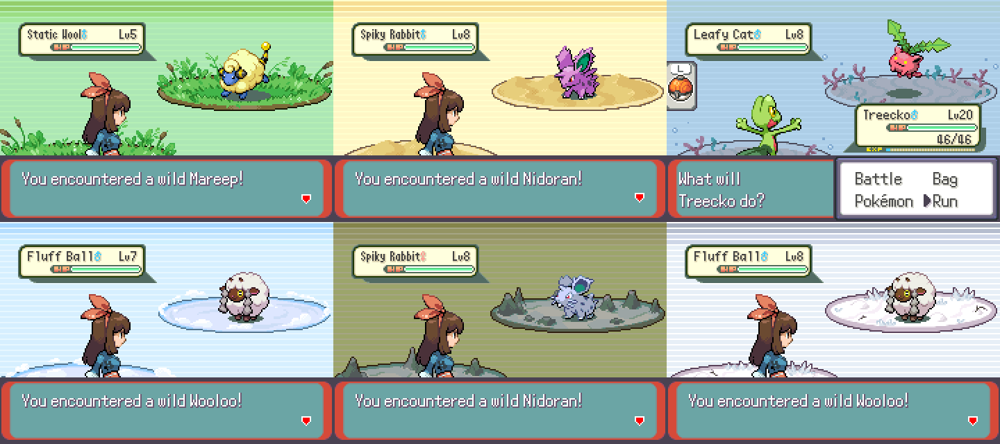

# Battle backgrounds

> Please credit PurrfectDoodle (Eva), as well as [the credits listed here](https://github.com/Pawkkie/Team-Aquas-Asset-Repo/tree/main/Battle%20Backgrounds/RavePossum), which this is based on :)

Here are some edits of some of the vanilla-ish battle backgrounds + new "grassy plains" background (note: this one was inspired by the grass in [LeoB's ORAS tileset](https://github.com/Pawkkie/Team-Aquas-Asset-Repo/tree/main/Tilesets/The%20Great%20Tileset%20Exchange/Full%20Tilesets/LeoB%20ORAS), and should therefore work well with it!)

> Pond, Sea & Grassy Plains commissioned by Zatsu.
>
> Long Grass, Sand, Underwater, Sky, Cave & Snow commissioned by Guille.
>
> Zatsu and Guille were kind enough to make these open source!