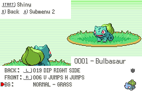

# RavePossum's Vanilla+ Battle Backgrounds

These are a set of battle backgrounds for Emerald based on combining the aesthetics of the Gen 4 battle platforms with the Gen 3 battle backgrounds. They borrow heavily from Ruki's battle BGs also featured in the repo here.



Key points:

 - These are ready to drag and drop straight into an Emerald decomp hack with a few code changes, which are listed below. Otherwise all you have to do is replace the contents of your graphics/battle_terrain folder with the one here and then run ``make clean`` before building again.
 - They have been modified in size and position from Ruki's originals so that they fit in the screen and the Pokemon shadows land in the right place.
 - **These are free to use and modify for anyone, but please credit RavePossum and Ruki**.

# Code Changes

Here are the code changes required for these to be drag-and-drop:

## include/graphics.h

```diff
...
- extern const u32 gBattleTerrainPalette_BuildingLeader[];
- extern const u32 gBattleTerrainPalette_StadiumAqua[];
- extern const u32 gBattleTerrainPalette_StadiumMagma[];
+ extern const u32 gBattleTerrainPalette_BuildingAqua[];
+ extern const u32 gBattleTerrainPalette_BuildingMagma[];
+ extern const u32 gBattleTerrainPalette_StadiumLeader[];
+ extern const u32 gBattleTerrainTiles_Plain[];
+ extern const u32 gBattleTerrainTilemap_Plain[];
...
```

## src/battle_bg.c
sBattleTerrainTable[]:
```diff
...
[BATTLE_TERRAIN_PLAIN] =
{
-	.tileset = gBattleTerrainTiles_Building,
-	.tilemap = gBattleTerrainTilemap_Building,
+	.tileset = gBattleTerrainTiles_Plain,
+	.tilemap = gBattleTerrainTilemap_Plain,
	.entryTileset = gBattleTerrainAnimTiles_Building,
	.entryTilemap = gBattleTerrainAnimTilemap_Building,
	.palette = gBattleTerrainPalette_Plain,
...
```
DrawMainBattleBackground():
```diff
...
u8 trainerClass = gTrainers[gTrainerBattleOpponent_A].trainerClass;
if (trainerClass == TRAINER_CLASS_LEADER)
{
-	LZDecompressVram(gBattleTerrainTiles_Building, (void *)(BG_CHAR_ADDR(2)));
-	LZDecompressVram(gBattleTerrainTilemap_Building, (void *)(BG_SCREEN_ADDR(26)));
-	LoadCompressedPalette(gBattleTerrainPalette_BuildingLeader, BG_PLTT_ID(2), 3 * PLTT_SIZE_4BPP);
+	LZDecompressVram(gBattleTerrainTiles_Stadium, (void *)(BG_CHAR_ADDR(2)));
+	LZDecompressVram(gBattleTerrainTilemap_Stadium, (void *)(BG_SCREEN_ADDR(26)));
+	LoadCompressedPalette(gBattleTerrainPalette_StadiumLeader, BG_PLTT_ID(2), 3 * PLTT_SIZE_4BPP);
	return;
}
else if (trainerClass == TRAINER_CLASS_CHAMPION)
...
```
```diff
...
	LoadCompressedPalette(gBattleTerrainPalette_BuildingGym, BG_PLTT_ID(2), 3 * PLTT_SIZE_4BPP);
	break;
case MAP_BATTLE_SCENE_MAGMA:
-	LZDecompressVram(gBattleTerrainTiles_Stadium, (void *)(BG_CHAR_ADDR(2)));
-	LZDecompressVram(gBattleTerrainTilemap_Stadium, (void *)(BG_SCREEN_ADDR(26)));
-	LoadCompressedPalette(gBattleTerrainPalette_StadiumMagma, BG_PLTT_ID(2), 3 * PLTT_SIZE_4BPP);
+	LZDecompressVram(gBattleTerrainTiles_Building, (void *)(BG_CHAR_ADDR(2)));
+	LZDecompressVram(gBattleTerrainTilemap_Building, (void *)(BG_SCREEN_ADDR(26)));
+	LoadCompressedPalette(gBattleTerrainPalette_BuildingMagma, BG_PLTT_ID(2), 3 * PLTT_SIZE_4BPP);
	break;
case MAP_BATTLE_SCENE_AQUA:
-	LZDecompressVram(gBattleTerrainTiles_Stadium, (void *)(BG_CHAR_ADDR(2)));
-	LZDecompressVram(gBattleTerrainTilemap_Stadium, (void *)(BG_SCREEN_ADDR(26)));
-	LoadCompressedPalette(gBattleTerrainPalette_StadiumAqua, BG_PLTT_ID(2), 3 * PLTT_SIZE_4BPP);
+	LZDecompressVram(gBattleTerrainTiles_Building, (void *)(BG_CHAR_ADDR(2)));
+	LZDecompressVram(gBattleTerrainTilemap_Building, (void *)(BG_SCREEN_ADDR(26)));
+	LoadCompressedPalette(gBattleTerrainPalette_BuildingAqua, BG_PLTT_ID(2), 3 * PLTT_SIZE_4BPP);
	break;
case MAP_BATTLE_SCENE_SIDNEY:
	LZDecompressVram(gBattleTerrainTiles_Stadium, (void *)(BG_CHAR_ADDR(2)));
...
```
LoadChosenBattleElement():
```diff
...
u8 trainerClass = gTrainers[gTrainerBattleOpponent_A].trainerClass;
if (trainerClass == TRAINER_CLASS_LEADER)
{
-	LZDecompressVram(gBattleTerrainTiles_Building, (void *)(BG_CHAR_ADDR(2)));
+	LZDecompressVram(gBattleTerrainTiles_Stadium, (void *)(BG_CHAR_ADDR(2)));
	break;
}
else if (trainerClass == TRAINER_CLASS_CHAMPION)
...
```
```diff
...
u8 trainerClass = gTrainers[gTrainerBattleOpponent_A].trainerClass;
if (trainerClass == TRAINER_CLASS_LEADER)
{
-	LZDecompressVram(gBattleTerrainTilemap_Building, (void *)(BG_SCREEN_ADDR(26)));
+	LZDecompressVram(gBattleTerrainTilemap_Stadium, (void *)(BG_SCREEN_ADDR(26)));
	break;
}
else if (trainerClass == TRAINER_CLASS_CHAMPION)
...
```
```diff
...
u8 trainerClass = gTrainers[gTrainerBattleOpponent_A].trainerClass;
if (trainerClass == TRAINER_CLASS_LEADER)
{
-	LoadCompressedPalette(gBattleTerrainPalette_BuildingLeader, BG_PLTT_ID(2), 3 * PLTT_SIZE_4BPP);
+	LoadCompressedPalette(gBattleTerrainPalette_StadiumLeader, BG_PLTT_ID(2), 3 * PLTT_SIZE_4BPP);
	break;
}
else if (trainerClass == TRAINER_CLASS_CHAMPION)
...
```
```diff
...
	LoadCompressedPalette(gBattleTerrainPalette_BuildingGym, BG_PLTT_ID(2), 3 * PLTT_SIZE_4BPP);
	break;
case MAP_BATTLE_SCENE_MAGMA:
-	LoadCompressedPalette(gBattleTerrainPalette_StadiumMagma, BG_PLTT_ID(2), 3 * PLTT_SIZE_4BPP);
+	LoadCompressedPalette(gBattleTerrainPalette_BuildingMagma, BG_PLTT_ID(2), 3 * PLTT_SIZE_4BPP);
	break;
case MAP_BATTLE_SCENE_AQUA:
-	LoadCompressedPalette(gBattleTerrainPalette_StadiumAqua, BG_PLTT_ID(2), 3 * PLTT_SIZE_4BPP);
+	LoadCompressedPalette(gBattleTerrainPalette_BuildingAqua, BG_PLTT_ID(2), 3 * PLTT_SIZE_4BPP);
	break;
case MAP_BATTLE_SCENE_SIDNEY:
	LoadCompressedPalette(gBattleTerrainPalette_StadiumSidney, BG_PLTT_ID(2), 3 * PLTT_SIZE_4BPP);
...
```
## src/data/graphics/battle_terrain.h
```diff
...
- const u32 gBattleTerrainPalette_Frontier[] = INCBIN_U32("graphics/battle_terrain/stadium/battle_frontier.gbapal.lz"); // this is also used for link battles
+ const u32 gBattleTerrainPalette_Frontier[] = INCBIN_U32("graphics/battle_terrain/building/battle_frontier.gbapal.lz"); // this is also used for link battles
...
- const u32 gBattleTerrainPalette_BuildingLeader[] = INCBIN_U32("graphics/battle_terrain/building/palette3.gbapal.lz");
- const u32 gBattleTerrainPalette_StadiumAqua[] = INCBIN_U32("graphics/battle_terrain/stadium/palette1.gbapal.lz");
- const u32 gBattleTerrainPalette_StadiumMagma[] = INCBIN_U32("graphics/battle_terrain/stadium/palette2.gbapal.lz");
+ const u32 gBattleTerrainPalette_BuildingAqua[] = INCBIN_U32("graphics/battle_terrain/building/palette4.gbapal.lz");
+ const u32 gBattleTerrainPalette_BuildingMagma[] = INCBIN_U32("graphics/battle_terrain/building/palette5.gbapal.lz");
+ const u32 gBattleTerrainPalette_StadiumLeader[] = INCBIN_U32("graphics/battle_terrain/stadium/palette8.gbapal.lz");
...
+ const u32 gBattleTerrainTiles_Plain[] = INCBIN_U32("graphics/battle_terrain/plain/tiles.4bpp.lz");
+ const u32 gBattleTerrainTilemap_Plain[] = INCBIN_U32("graphics/battle_terrain/plain/map.bin.lz");
```

## src/pokemon_debug.c (RHH pokeemerald-expansion ONLY)
LoadBattleBg():
```diff
...
	LoadCompressedPalette(gBattleTerrainPalette_BuildingGym, 0x20, 0x60);
	break;
case MAP_BATTLE_SCENE_MAGMA:
-	LZDecompressVram(gBattleTerrainTiles_Stadium, (void*)(BG_CHAR_ADDR(2)));
-	LZDecompressVram(gBattleTerrainTilemap_Stadium, (void*)(BG_SCREEN_ADDR(26)));
-	LoadCompressedPalette(gBattleTerrainPalette_StadiumMagma, 0x20, 0x60);
+	LZDecompressVram(gBattleTerrainTiles_Building, (void*)(BG_CHAR_ADDR(2)));
+	LZDecompressVram(gBattleTerrainTilemap_Building, (void*)(BG_SCREEN_ADDR(26)));
+	LoadCompressedPalette(gBattleTerrainPalette_BuildingMagma, 0x20, 0x60);
	break;
case MAP_BATTLE_SCENE_AQUA:
-	LZDecompressVram(gBattleTerrainTiles_Stadium, (void*)(BG_CHAR_ADDR(2)));
-	LZDecompressVram(gBattleTerrainTilemap_Stadium, (void*)(BG_SCREEN_ADDR(26)));
-	LoadCompressedPalette(gBattleTerrainPalette_StadiumAqua, 0x20, 0x60);
+	LZDecompressVram(gBattleTerrainTiles_Building, (void*)(BG_CHAR_ADDR(2)));
+	LZDecompressVram(gBattleTerrainTilemap_Building, (void*)(BG_SCREEN_ADDR(26)));
+	LoadCompressedPalette(gBattleTerrainPalette_BuildingAqua, 0x20, 0x60);
	break;
case MAP_BATTLE_SCENE_SIDNEY:
	LZDecompressVram(gBattleTerrainTiles_Stadium, (void*)(BG_CHAR_ADDR(2)));
...
	LoadCompressedPalette(gBattleTerrainPalette_Frontier, 0x20, 0x60);
	break;
case MAP_BATTLE_SCENE_LEADER:
-	LZDecompressVram(gBattleTerrainTiles_Building, (void*)(BG_CHAR_ADDR(2)));
-	LZDecompressVram(gBattleTerrainTilemap_Building, (void*)(BG_SCREEN_ADDR(26)));
-	LoadCompressedPalette(gBattleTerrainPalette_BuildingLeader, 0x20, 0x60);
+	LZDecompressVram(gBattleTerrainTiles_Stadium, (void*)(BG_CHAR_ADDR(2)));
+	LZDecompressVram(gBattleTerrainTilemap_Stadium, (void*)(BG_SCREEN_ADDR(26)));
+	LoadCompressedPalette(gBattleTerrainPalette_StadiumLeader, 0x20, 0x60);
	break;
case MAP_BATTLE_SCENE_WALLACE:
	LZDecompressVram(gBattleTerrainTiles_Stadium, (void*)(BG_CHAR_ADDR(2)));
...
```