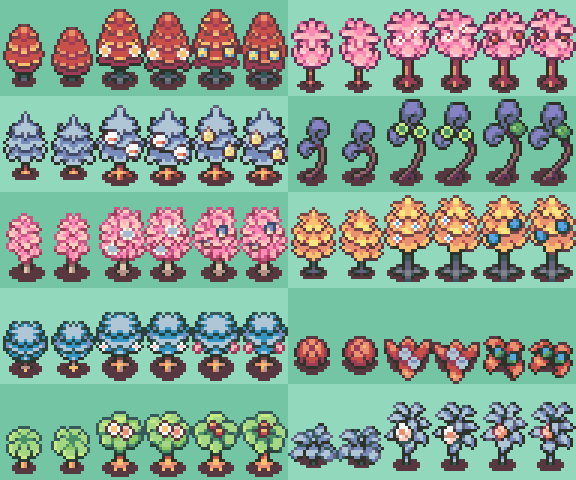

# Better berry trees

> Please credit **"Eva / PurrfectDoodle"**!

The vanilla RSE berries use a small handful of common palettes. I love taking up palette space for small details that nobody will notice ever, so now each uses its own palette with (arguably) better-looking colors!

More berry trees might be added later if I decide to recolor more of them.

I tried making the berries in the berry stage resemble the actual berries more, and I took a few creative liberties (ex. I recolored the cheri berry tree from green to pink to remind of flowering cherry trees).

> NOTE: If you want to use these with pokeemerald, you'll have to fiddle around with the part of the code that handles the berry tree palettes. I managed to make it work, but it's all a painful blur, and I can't find the isolated commit for those changes at the moment. Sorry :')