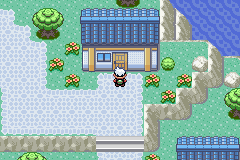

## Rolling Spheal Animation
- Please credit Kasen for use




This requires some code changes to make work properly.

Since there's so many frames, the `sPicTable` is different from normal. Here's mine:

```
static const struct SpriteFrameImage sPicTable_Spheal[] = {
    overworld_frame(gObjectEventPic_Spheal, 4, 4, 0),
    overworld_frame(gObjectEventPic_Spheal, 4, 4, 1),
    overworld_frame(gObjectEventPic_Spheal, 4, 4, 2),
    overworld_frame(gObjectEventPic_Spheal, 4, 4, 3),
    overworld_frame(gObjectEventPic_Spheal, 4, 4, 4),
    overworld_frame(gObjectEventPic_Spheal, 4, 4, 5),
    overworld_frame(gObjectEventPic_Spheal, 4, 4, 6),
    overworld_frame(gObjectEventPic_Spheal, 4, 4, 7),
    overworld_frame(gObjectEventPic_Spheal, 4, 4, 8),
    overworld_frame(gObjectEventPic_Spheal, 4, 4, 9),
    overworld_frame(gObjectEventPic_Spheal, 4, 4, 10),
    overworld_frame(gObjectEventPic_Spheal, 4, 4, 11),
    overworld_frame(gObjectEventPic_Spheal, 4, 4, 12),
    overworld_frame(gObjectEventPic_Spheal, 4, 4, 13),
    overworld_frame(gObjectEventPic_Spheal, 4, 4, 14),
    overworld_frame(gObjectEventPic_Spheal, 4, 4, 15),
    overworld_frame(gObjectEventPic_Spheal, 4, 4, 16),
    overworld_frame(gObjectEventPic_Spheal, 4, 4, 17),
    overworld_frame(gObjectEventPic_Spheal, 4, 4, 18),
    overworld_frame(gObjectEventPic_Spheal, 4, 4, 19),
    overworld_frame(gObjectEventPic_Spheal, 4, 4, 20),
    overworld_frame(gObjectEventPic_Spheal, 4, 4, 21),
    overworld_frame(gObjectEventPic_Spheal, 4, 4, 22),
    overworld_frame(gObjectEventPic_Spheal, 4, 4, 23),
    overworld_frame(gObjectEventPic_Spheal, 4, 4, 24),
    overworld_frame(gObjectEventPic_Spheal, 4, 4, 25),
    overworld_frame(gObjectEventPic_Spheal, 4, 4, 26),
};
```

You'll also need custom animations for the actual rolling. These go in `src\data\object_events\object_event_anims.h`:

```
static const union AnimCmd *const sAnimTable_Spheal[] = {
    [ANIM_STD_FACE_SOUTH] = sAnim_FaceSouth,
    [ANIM_STD_FACE_NORTH] = sAnim_FaceNorth,
    [ANIM_STD_FACE_WEST] = sAnim_FaceWest,
    [ANIM_STD_FACE_EAST] = sAnim_FaceEast,
    [ANIM_STD_GO_SOUTH] = sAnim_GoSouthSpheal,
    [ANIM_STD_GO_NORTH] = sAnim_GoNorthSpheal,
    [ANIM_STD_GO_WEST] = sAnim_GoWestSpheal,
    [ANIM_STD_GO_EAST] = sAnim_GoEastSpheal,
    [ANIM_STD_GO_FAST_SOUTH] = sAnim_GoSouthFastSpheal,
    [ANIM_STD_GO_FAST_NORTH] = sAnim_GoNorthFastSpheal,
    [ANIM_STD_GO_FAST_WEST] = sAnim_GoWestFastSpheal,
    [ANIM_STD_GO_FAST_EAST] = sAnim_GoEastFastSpheal,
    [ANIM_STD_GO_FASTER_SOUTH] = sAnim_GoSouthFasterSpheal,
    [ANIM_STD_GO_FASTER_NORTH] = sAnim_GoNorthFasterSpheal,
    [ANIM_STD_GO_FASTER_WEST] = sAnim_GoWestFasterSpheal,
    [ANIM_STD_GO_FASTER_EAST] = sAnim_GoEastFasterSpheal,
    [ANIM_STD_GO_FASTEST_SOUTH] = sAnim_GoSouthFastestSpheal,
    [ANIM_STD_GO_FASTEST_NORTH] = sAnim_GoNorthFastestSpheal,
    [ANIM_STD_GO_FASTEST_WEST] = sAnim_GoWestFastestSpheal,
    [ANIM_STD_GO_FASTEST_EAST] = sAnim_GoEastFastestSpheal,
};
```

These are a bit fast for my taste but I couldn't really make them slower without some desync issues.

```
static const union AnimCmd sAnim_GoSouthSpheal[] =
{
    ANIMCMD_FRAME(3, 2),
    ANIMCMD_FRAME(4, 2),
    ANIMCMD_FRAME(5, 2),
    ANIMCMD_FRAME(6, 2),
    ANIMCMD_FRAME(7, 2),
    ANIMCMD_FRAME(8, 2),
    ANIMCMD_FRAME(9, 2),
    ANIMCMD_FRAME(10, 2),
    ANIMCMD_JUMP(0),
};

static const union AnimCmd sAnim_GoNorthSpheal[] =
{
    ANIMCMD_FRAME(11, 2),
    ANIMCMD_FRAME(12, 2),
    ANIMCMD_FRAME(13, 2),
    ANIMCMD_FRAME(14, 2),
    ANIMCMD_FRAME(15, 2),
    ANIMCMD_FRAME(16, 2),
    ANIMCMD_FRAME(17, 2),
    ANIMCMD_FRAME(18, 2),
    ANIMCMD_JUMP(0),
};

static const union AnimCmd sAnim_GoWestSpheal[] =
{
    ANIMCMD_FRAME(19, 2),
    ANIMCMD_FRAME(20, 2),
    ANIMCMD_FRAME(21, 2),
    ANIMCMD_FRAME(22, 2),
    ANIMCMD_FRAME(23, 2),
    ANIMCMD_FRAME(24, 2),
    ANIMCMD_FRAME(25, 2),
    ANIMCMD_FRAME(26, 2),
    ANIMCMD_JUMP(0),
};

static const union AnimCmd sAnim_GoEastSpheal[] =
{
    ANIMCMD_FRAME(19, 2, .hFlip = TRUE),
    ANIMCMD_FRAME(20, 2, .hFlip = TRUE),
    ANIMCMD_FRAME(21, 2, .hFlip = TRUE),
    ANIMCMD_FRAME(22, 2, .hFlip = TRUE),
    ANIMCMD_FRAME(23, 2, .hFlip = TRUE),
    ANIMCMD_FRAME(24, 2, .hFlip = TRUE),
    ANIMCMD_FRAME(25, 2, .hFlip = TRUE),
    ANIMCMD_FRAME(26, 2, .hFlip = TRUE),
    ANIMCMD_JUMP(0),
};

static const union AnimCmd sAnim_GoSouthFastSpheal[] =
{
    ANIMCMD_FRAME(3, 1),
    ANIMCMD_FRAME(4, 1),
    ANIMCMD_FRAME(5, 1),
    ANIMCMD_FRAME(6, 1),
    ANIMCMD_FRAME(7, 1),
    ANIMCMD_FRAME(8, 1),
    ANIMCMD_FRAME(9, 1),
    ANIMCMD_FRAME(10, 1),
    ANIMCMD_JUMP(0),
};

static const union AnimCmd sAnim_GoNorthFastSpheal[] =
{
    ANIMCMD_FRAME(11, 1),
    ANIMCMD_FRAME(12, 1),
    ANIMCMD_FRAME(13, 1),
    ANIMCMD_FRAME(14, 1),
    ANIMCMD_FRAME(15, 1),
    ANIMCMD_FRAME(16, 1),
    ANIMCMD_FRAME(17, 1),
    ANIMCMD_FRAME(18, 1),
    ANIMCMD_JUMP(0),
};

static const union AnimCmd sAnim_GoWestFastSpheal[] =
{
    ANIMCMD_FRAME(19, 1),
    ANIMCMD_FRAME(20, 1),
    ANIMCMD_FRAME(21, 1),
    ANIMCMD_FRAME(22, 1),
    ANIMCMD_FRAME(23, 1),
    ANIMCMD_FRAME(24, 1),
    ANIMCMD_FRAME(25, 1),
    ANIMCMD_FRAME(26, 1),
    ANIMCMD_JUMP(0),
};

static const union AnimCmd sAnim_GoEastFastSpheal[] =
{
    ANIMCMD_FRAME(19, 1, .hFlip = TRUE),
    ANIMCMD_FRAME(20, 1, .hFlip = TRUE),
    ANIMCMD_FRAME(21, 1, .hFlip = TRUE),
    ANIMCMD_FRAME(22, 1, .hFlip = TRUE),
    ANIMCMD_FRAME(23, 1, .hFlip = TRUE),
    ANIMCMD_FRAME(24, 1, .hFlip = TRUE),
    ANIMCMD_FRAME(25, 1, .hFlip = TRUE),
    ANIMCMD_FRAME(26, 1, .hFlip = TRUE),
    ANIMCMD_JUMP(0),
};

static const union AnimCmd sAnim_GoSouthFasterSpheal[] =
{
    ANIMCMD_FRAME(3, 1),
    ANIMCMD_FRAME(5, 1),
    ANIMCMD_FRAME(7, 1),
    ANIMCMD_FRAME(9, 1),
    ANIMCMD_JUMP(0),
};

static const union AnimCmd sAnim_GoNorthFasterSpheal[] =
{
    ANIMCMD_FRAME(11, 1),
    ANIMCMD_FRAME(13, 1),
    ANIMCMD_FRAME(15, 1),
    ANIMCMD_FRAME(17, 1),
    ANIMCMD_JUMP(0),
};

static const union AnimCmd sAnim_GoWestFasterSpheal[] =
{
    ANIMCMD_FRAME(19, 1),
    ANIMCMD_FRAME(21, 1),
    ANIMCMD_FRAME(23, 1),
    ANIMCMD_FRAME(25, 1),
    ANIMCMD_JUMP(0),
};

static const union AnimCmd sAnim_GoEastFasterSpheal[] =
{
    ANIMCMD_FRAME(19, 1, .hFlip = TRUE),
    ANIMCMD_FRAME(21, 1, .hFlip = TRUE),
    ANIMCMD_FRAME(23, 1, .hFlip = TRUE),
    ANIMCMD_FRAME(25, 1, .hFlip = TRUE),
    ANIMCMD_JUMP(0),
};

static const union AnimCmd sAnim_GoSouthFastestSpheal[] =
{
    ANIMCMD_FRAME(3, 1),
    ANIMCMD_FRAME(5, 1),
    ANIMCMD_FRAME(7, 1),
    ANIMCMD_FRAME(9, 1),
    ANIMCMD_JUMP(0),
};

static const union AnimCmd sAnim_GoNorthFastestSpheal[] =
{
    ANIMCMD_FRAME(13, 1),
    ANIMCMD_FRAME(15, 1),
    ANIMCMD_FRAME(17, 1),
    ANIMCMD_FRAME(11, 1),
    ANIMCMD_JUMP(0),
};

static const union AnimCmd sAnim_GoWestFastestSpheal[] =
{
    ANIMCMD_FRAME(21, 1),
    ANIMCMD_FRAME(23, 1),
    ANIMCMD_FRAME(25, 1),
    ANIMCMD_FRAME(19, 1),
    ANIMCMD_JUMP(0),
};

static const union AnimCmd sAnim_GoEastFastestSpheal[] =
{
    ANIMCMD_FRAME(21, 1, .hFlip = TRUE),
    ANIMCMD_FRAME(23, 1, .hFlip = TRUE),
    ANIMCMD_FRAME(25, 1, .hFlip = TRUE),
    ANIMCMD_FRAME(19, 1, .hFlip = TRUE),
    ANIMCMD_JUMP(0),
};
```

And finally, still in the same file:

```diff
static const struct StepAnimTable sStepAnimTables[] = {
    {
        .anims = sAnimTable_QuintyPlump,
        .animPos = {1, 3, 0, 2},
    },
    {
        .anims = sAnimTable_Standard,
        .animPos = {1, 3, 0, 2},
    },
+    {
+        .anims = sAnimTable_Spheal,
+        .animPos = {0, 0, 0, 0},
+    },
```