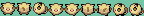
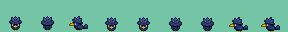
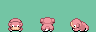

## Kyu's Overworld Pokemon Sprites
- Overworld sprites
- Slowpoke sprite ripped by null from FRLG, then edited by KyuZee
- Other sprites made by KyuZee





## How to Use
If you haven't inserted sprites before, I am going to recommend you first merge Overworld Expansion and Dynamic Overworld Palette System into your project. This will allow you to add custom sprites and palettes to your project without replacing the defaults. Adding these sprites without implementing those features is not worth the effort, so for this guide I'm going to assume you have,

Now, we start by adding the filepaths to the game in `object_event_graphics.h`.
You can add these anywhere. Also, don't worry about converting your png and pal files. The compiler will do that for you when you build. Simply make sure your png and pal files have the correct filepath.
```
const u32 gObjectEventPic_Mankey[] = INCBIN_U32("graphics/object_events/pics/pokemon/mankey.4bpp");
const u16 gObjectEventPal_Mankey[] = INCBIN_U16("graphics/object_events/palettes/mankey.gbapal");
const u32 gObjectEventPic_Murkrow[] = INCBIN_U32("graphics/object_events/pics/pokemon/murkrow.4bpp");
const u16 gObjectEventPal_Murkrow[] = INCBIN_U16("graphics/object_events/palettes/murkrow.gbapal");
const u32 gObjectEventPic_Slowpoke[] = INCBIN_U32("graphics/object_events/pics/pokemon/slowpoke.4bpp");
const u16 gObjectEventPal_Slowpoke[] = INCBIN_U16("graphics/object_events/palettes/slowpoke.gbapal");
```

Next, we define how many tiles one frame of our spritesheet is in `spritesheet_rules.mk`.
Once again, you can add these anywhere. A tile is eight pixel by eight pixel square btw.
```
$(OBJEVENTGFXDIR)/pokemon/mankey.4bpp: %.4bpp: %.png
	$(GFX) $< $@ -mwidth 2 -mheight 2

$(OBJEVENTGFXDIR)/pokemon/murkrow.4bpp: %.4bpp: %.png
	$(GFX) $< $@ -mwidth 4 -mheight 4

$(OBJEVENTGFXDIR)/pokemon/slowpoke.4bpp: %.4bpp: %.png
	$(GFX) $< $@ -mwidth 4 -mheight 4
```

Now, in `object_event_pic_tables.h`, we're going to label the frames of our spritesheet so that we can attach animations to them.
The three numbers at the end represent tiles wide, tiles tall, and the animation step that the frame will be associated with. For most spritesheets it will be ordered from zero to eight. For slowpoke though who doesn't walk it's going to reuse its idle frames. Most default pokemon do this which is why they slide around when moving.
Again, add these anywhere.
```
static const struct SpriteFrameImage sPicTable_Mankey[] = {
    overworld_frame(gObjectEventPic_Mankey, 2, 2, 0),
    overworld_frame(gObjectEventPic_Mankey, 2, 2, 1),
    overworld_frame(gObjectEventPic_Mankey, 2, 2, 2),
    overworld_frame(gObjectEventPic_Mankey, 2, 2, 3),
    overworld_frame(gObjectEventPic_Mankey, 2, 2, 4),
    overworld_frame(gObjectEventPic_Mankey, 2, 2, 5),
    overworld_frame(gObjectEventPic_Mankey, 2, 2, 6),
    overworld_frame(gObjectEventPic_Mankey, 2, 2, 7),
    overworld_frame(gObjectEventPic_Mankey, 2, 2, 8),
};

static const struct SpriteFrameImage sPicTable_Murkrow[] = {
    overworld_frame(gObjectEventPic_Murkrow, 4, 4, 0),
    overworld_frame(gObjectEventPic_Murkrow, 4, 4, 1),
    overworld_frame(gObjectEventPic_Murkrow, 4, 4, 2),
    overworld_frame(gObjectEventPic_Murkrow, 4, 4, 3),
    overworld_frame(gObjectEventPic_Murkrow, 4, 4, 4),
    overworld_frame(gObjectEventPic_Murkrow, 4, 4, 5),
    overworld_frame(gObjectEventPic_Murkrow, 4, 4, 6),
    overworld_frame(gObjectEventPic_Murkrow, 4, 4, 7),
    overworld_frame(gObjectEventPic_Murkrow, 4, 4, 8),
};

static const struct SpriteFrameImage sPicTable_Slowpoke[] = {
    overworld_frame(gObjectEventPic_Slowpoke, 4, 4, 0),
    overworld_frame(gObjectEventPic_Slowpoke, 4, 4, 1),
    overworld_frame(gObjectEventPic_Slowpoke, 4, 4, 2),
    overworld_frame(gObjectEventPic_Slowpoke, 4, 4, 0),
    overworld_frame(gObjectEventPic_Slowpoke, 4, 4, 0),
    overworld_frame(gObjectEventPic_Slowpoke, 4, 4, 1),
    overworld_frame(gObjectEventPic_Slowpoke, 4, 4, 1),
    overworld_frame(gObjectEventPic_Slowpoke, 4, 4, 2),
    overworld_frame(gObjectEventPic_Slowpoke, 4, 4, 2),
};
```

Now, in `event_objects.h`, we start preparing our spritesheet to actually be used.
The file opens up with a long line of defines following this format:
`#define OBJ_EVENT_GFX_YOUR_OBJECT_HERE                  ###`
This should end with:
```

// NOTE: By default, the max value for NUM_OBJ_EVENT_GFX is 239.
//
// Object event graphics ids are 1 byte in size (max value of 255), and the dynamic
// graphics ids that start after NUM_OBJ_EVENT_GFX reach this limit. No graphics id
// uses the value 239 itself, so removing the "+ 1" in OBJ_EVENT_GFX_VARS would
// allow increasing NUM_OBJ_EVENT_GFX to 240. There are also a handful of unused
// object graphics that can be removed. If more graphics are needed, anything that
// stores graphics ids will need to be increased in size. See wiki entry below:
// https://github.com/pret/pokeemerald/wiki/Feature-Branches#overworld-expansion
#define NUM_OBJ_EVENT_GFX                        239
```
The important part being the last define underneath the helpful note. It should be whatever the number of your last object event was plus one.
So, assuming this is your first time adding a new object event, it should be implemented like this:
```diff
	#define OBJ_EVENT_GFX_HOOH                       238
+	#define OBJ_EVENT_GFX_MANKEY                     239
+ 	#define OBJ_EVENT_GFX_MURKROW                    240
+ 	#define OBJ_EVENT_GFX_SLOWPOKE                   241

	// NOTE: By default, the max value for NUM_OBJ_EVENT_GFX is 239.
	//
	// Object event graphics ids are 1 byte in size (max value of 255), and the dynamic
	// graphics ids that start after NUM_OBJ_EVENT_GFX reach this limit. No graphics id
	// uses the value 239 itself, so removing the "+ 1" in OBJ_EVENT_GFX_VARS would
	// allow increasing NUM_OBJ_EVENT_GFX to 240. There are also a handful of unused
	// object graphics that can be removed. If more graphics are needed, anything that
	// stores graphics ids will need to be increased in size. See wiki entry below:
	// https://github.com/pret/pokeemerald/wiki/Feature-Branches#overworld-expansion
-	#define NUM_OBJ_EVENT_GFX                        239
+	#define NUM_OBJ_EVENT_GFX                        242
```

Now, go to `object_event_graphics_info_pointers.h`.
Add these somewhere with the other similar lines that this file starts with.
```
extern const struct ObjectEventGraphicsInfo gObjectEventGraphicsInfo_Mankey;
extern const struct ObjectEventGraphicsInfo gObjectEventGraphicsInfo_Murkrow;
extern const struct ObjectEventGraphicsInfo gObjectEventGraphicsInfo_Slowpoke;
```

Underneath those, you'll find a line that reads:
`const struct ObjectEventGraphicsInfo *const gObjectEventGraphicsInfoPointers[NUM_OBJ_EVENT_GFX] = {`
Somewhere within that bracket, add:
```
	[OBJ_EVENT_GFX_MANKEY] =                   &gObjectEventGraphicsInfo_Mankey,
    [OBJ_EVENT_GFX_MURKROW] =                  &gObjectEventGraphicsInfo_Murkrow,
    [OBJ_EVENT_GFX_SLOWPOKE] =                 &gObjectEventGraphicsInfo_Slowpoke,
```

Next, in `event_object_movement.c`, we're going to set up our palette for use.
Search for `#define OBJ_EVENT_PAL_TAG_NONE                    0x11FF` and we're going to squeeze our palettes in between that and your last palette.
If you've yet to add any palettes, it would be implemented like this:
```diff
	#define OBJ_EVENT_PAL_TAG_RS_MAY                  0x1123
+	#define OBJ_EVENT_GFX_MANKEY                      0x1124
+ 	#define OBJ_EVENT_GFX_MURKROW                     0x1125
+ 	#define OBJ_EVENT_GFX_SLOWPOKE                    0x1126
	#define OBJ_EVENT_PAL_TAG_NONE                    0x11FF
```
I don't understand hex, but I've just been increasing the number by one each time and that's been working so far.

In the same file after a couple includes, you'll see a line that reads:
`static const struct SpritePalette sObjectEventSpritePalettes[] = {`
Inside that bracket, add these:
```
    {gObjectEventPal_Mankey,                OBJ_EVENT_PAL_TAG_MANKEY},
    {gObjectEventPal_Murkrow,               OBJ_EVENT_PAL_TAG_MURKROW},
    {gObjectEventPal_Slowpoke,              OBJ_EVENT_PAL_TAG_SLOWPOKE},
```

For our last stop, we'll be going to `object_event_graphics_info.h`. You can tweak a lot of things in here that I haven't explored fully yet, so I'm not going to go over everything.
Just add these somewhere in the file:
```
const struct ObjectEventGraphicsInfo gObjectEventGraphicsInfo_Mankey = {
    .tileTag = TAG_NONE,
    .paletteTag = OBJ_EVENT_PAL_TAG_MANKEY,
    .reflectionPaletteTag = OBJ_EVENT_PAL_TAG_NONE,
    .size = 128,
    .width = 16,
    .height = 16,
    .paletteSlot = PALSLOT_NPC_SPECIAL,
    .shadowSize = SHADOW_SIZE_M,
    .inanimate = FALSE,
    .disableReflectionPaletteLoad = FALSE,
    .tracks = TRACKS_FOOT,
    .oam = &gObjectEventBaseOam_16x16,
    .subspriteTables = sOamTables_16x16,
    .anims = sAnimTable_Standard,
    .images = sPicTable_Mankey,
    .affineAnims = gDummySpriteAffineAnimTable,
};

const struct ObjectEventGraphicsInfo gObjectEventGraphicsInfo_Murkrow = {
    .tileTag = TAG_NONE,
    .paletteTag = OBJ_EVENT_PAL_TAG_MURKROW,
    .reflectionPaletteTag = OBJ_EVENT_PAL_TAG_NONE,
    .size = 512,
    .width = 32,
    .height = 32,
    .paletteSlot = PALSLOT_NPC_SPECIAL,
    .shadowSize = SHADOW_SIZE_M,
    .inanimate = FALSE,
    .disableReflectionPaletteLoad = FALSE,
    .tracks = TRACKS_FOOT,
    .oam = &gObjectEventBaseOam_32x32,
    .subspriteTables = sOamTables_32x32,
    .anims = sAnimTable_Standard,
    .images = sPicTable_Murkrow,
    .affineAnims = gDummySpriteAffineAnimTable,
};

const struct ObjectEventGraphicsInfo gObjectEventGraphicsInfo_Slowpoke = {
    .tileTag = TAG_NONE,
    .paletteTag = OBJ_EVENT_PAL_TAG_SLOWPOKE,
    .reflectionPaletteTag = OBJ_EVENT_PAL_TAG_NONE,
    .size = 512,
    .width = 32,
    .height = 32,
    .paletteSlot = PALSLOT_NPC_SPECIAL,
    .shadowSize = SHADOW_SIZE_M,
    .inanimate = FALSE,
    .disableReflectionPaletteLoad = FALSE,
    .tracks = TRACKS_FOOT,
    .oam = &gObjectEventBaseOam_32x32,
    .subspriteTables = sOamTables_32x32,
    .anims = sAnimTable_Standard,
    .images = sPicTable_Slowpoke,
    .affineAnims = gDummySpriteAffineAnimTable,
};
```

If you decide to do more object events on your own, just remember to adjust the values of `.paletteTag` and `.images`. `.size`, `.width`, `.height`, `.oam`, and `.subspriteTables` will also change depending on the dimensions of the frame. Generally everything else will stay the same. The palette slot won't matter if you're using Dynamic Palettes, but technically for custom palettes they would be `PALSLOT_NPC_SPECIAL`.

And there you go! Now your pokemon should show up as options in PoryMap under objects and you can add them to your maps!