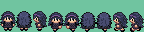
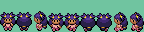

## Assored OW Trainers
- Please credit Kasen







## Korrina Changes

You'll need custom animation for the overworld object. Also remember to se the anims in `object_event_graphics_info.h` to `sAnimTable_Korrina`. Here's an example using the default walking speed.

In `src/data/object_events/object_event_anims.h`, add:

```
static const union AnimCmd *const sAnimTable_Korrina[] = {
    [ANIM_STD_FACE_SOUTH] = sAnim_FaceSouth,
    [ANIM_STD_FACE_NORTH] = sAnim_FaceNorth,
    [ANIM_STD_FACE_WEST] = sAnim_FaceWest,
    [ANIM_STD_FACE_EAST] = sAnim_FaceEast,
    [ANIM_STD_GO_SOUTH] = sAnim_KorrinaSouth,
    [ANIM_STD_GO_NORTH] = sAnim_KorrinaNorth,
    [ANIM_STD_GO_WEST] = sAnim_KorrinaWest,
    [ANIM_STD_GO_EAST] = sAnim_KorrinaEast,
    [ANIM_STD_GO_FAST_SOUTH] = sAnim_GoFastSouth,
    [ANIM_STD_GO_FAST_NORTH] = sAnim_GoFastNorth,
    [ANIM_STD_GO_FAST_WEST] = sAnim_GoFastWest,
    [ANIM_STD_GO_FAST_EAST] = sAnim_GoFastEast,
    [ANIM_STD_GO_FASTER_SOUTH] = sAnim_GoFasterSouth,
    [ANIM_STD_GO_FASTER_NORTH] = sAnim_GoFasterNorth,
    [ANIM_STD_GO_FASTER_WEST] = sAnim_GoFasterWest,
    [ANIM_STD_GO_FASTER_EAST] = sAnim_GoFasterEast,
    [ANIM_STD_GO_FASTEST_SOUTH] = sAnim_GoFastestSouth,
    [ANIM_STD_GO_FASTEST_NORTH] = sAnim_GoFastestNorth,
    [ANIM_STD_GO_FASTEST_WEST] = sAnim_GoFastestWest,
    [ANIM_STD_GO_FASTEST_EAST] = sAnim_GoFastestEast,
};
```

and also 

```
static const union AnimCmd sAnim_KorrinaSouth[] =
{
    ANIMCMD_FRAME(3, 12),
    ANIMCMD_FRAME(0, 4),
    ANIMCMD_FRAME(4, 12),
    ANIMCMD_FRAME(0, 4),
    ANIMCMD_JUMP(0),
};

static const union AnimCmd sAnim_KorrinaNorth[] =
{
    ANIMCMD_FRAME(5, 12),
    ANIMCMD_FRAME(1, 4),
    ANIMCMD_FRAME(6, 12),
    ANIMCMD_FRAME(1, 4),
    ANIMCMD_JUMP(0),
};

static const union AnimCmd sAnim_KorrinaWest[] =
{
    ANIMCMD_FRAME(7, 12),
    ANIMCMD_FRAME(2, 4),
    ANIMCMD_FRAME(8, 12),
    ANIMCMD_FRAME(2, 4),
    ANIMCMD_JUMP(0),
};

static const union AnimCmd sAnim_KorrinaEast[] =
{
    ANIMCMD_FRAME(7, 12, .hFlip = TRUE),
    ANIMCMD_FRAME(2, 4, .hFlip = TRUE),
    ANIMCMD_FRAME(8, 12, .hFlip = TRUE),
    ANIMCMD_FRAME(2, 4, .hFlip = TRUE),
    ANIMCMD_JUMP(0),
};
```

and finally, at the bottom where it reads `static const struct StepAnimTable sStepAnimTables[] = {`, add this somewhere below it:

```
{
        .anims = sAnimTable_Korrina,
        .animPos = {1, 1, 1, 1},
    },
```
