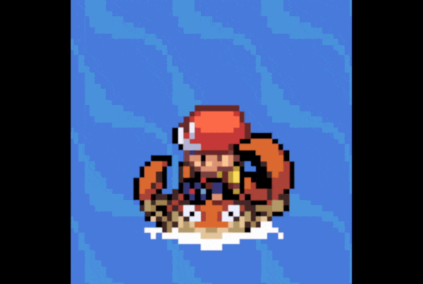
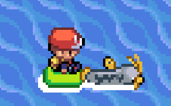

# Surfing OW Sprites
Based on: https://github.com/Shiny-Miner/dynamic_surf_ows_masters-expansion

The player is placed on top of the surf OW sprite, using our C-injection repository linked above.

Originally intended for use with Fire Red

## Edge Cases

### 64x64 sprites
Some Pokemon use a 64x64 sprite, instead of 32x32

### Asymmetrical Pokemon
Some Pokemon may support a unique east/west (left/right) facing sprite!
Kingler has asymmetrical claws, so in order to keep it biologically accurate, our project added support!

This will mean its sprite differs from most other sprites included in this folder:

### 4-frame animated sprites
Some Pokemon may also support 4-frame animations, to provide a smoother transition between poses, or to better support additional details. In Snorlax's case, it actually uses **all 3** of the above edge cases, being all at once a:
- 64x64 Sprite
- Asymmetrical Sprite (so that the Zs when it snores are not mirrored when facing East/Right)
- 4-Frame Animated Sprite

### Pokemon with a Raft
Some Pokemon are Little Guys™, and we've given them a raft to tug the player along on

---

## "Various Artists (HGSS Edits)" folder
Various artists contributed edited sprites [Gen 1](https://www.spriters-resource.com/ds_dsi/pokemonheartgoldsoulsilver/sheet/26794/), [Gen 2](https://www.spriters-resource.com/fullview/26795/), and [Gen 3](https://www.spriters-resource.com/ds_dsi/pokemonheartgoldsoulsilver/sheet/26795/) from the Following Pokemon feature of Heart Gold and Soul Silver. Please let me know if you've contributed, and would like specific credit for specific Pokemon; This is rabbit hole to unravel, but here are the names we could verify:
- [Ghoulslash](https://github.com/ghoulslash/dynamic_surf_ows)
- [grunt-lucas](https://github.com/grunt-lucas/pokeemerald-expansion/tree/surfable/graphics/object_events/pics/pokemon/surfable)
- [Slawter666](https://github.com/Slawter666/pokeemerald/blob/surfable/graphics/event_objects/pics/pokemon/surfable)
- [Surskitty](https://github.com/surskitty/pokeemerald/tree/surfable/graphics/object_events/pics/pokemon/surfable)
- [wally-217](https://github.com/zacwalton/pokeemerald-expansion/tree/master/graphics/object_events/pics/pokemon/surfable)
