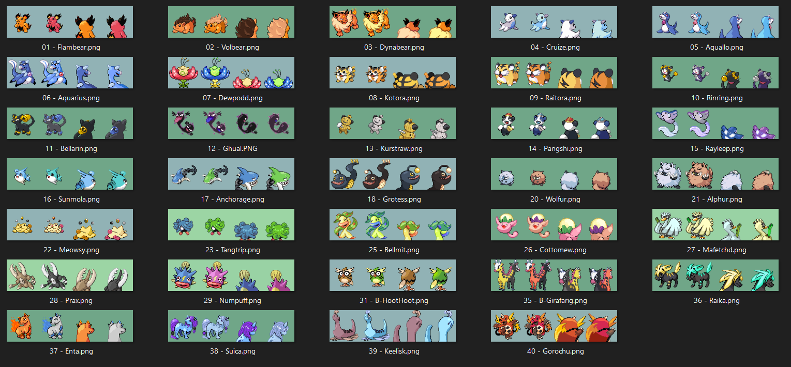
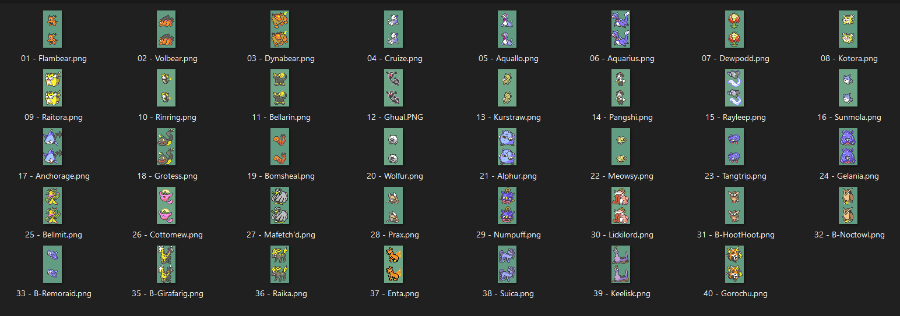

# GS BETA POKEMON SPRITE PACK
_Packaged by TibJib_

This pack contains all the sprites I used for my FireRed rom hack Bill's Secret Garden, link below for reference:
https://www.romhacking.net/hacks/8785/

While I did put a lot of time and effort into creating these sprites, my work was built on the backs of others. If you use any of these sprites, be sure to credit the appropriate parties that are listed below.

I would like this to be a community repository for everyone to use. In that spirit, if you make any improvements or additions to the sprites included here, I would appreciate it if you reach out to me to have the new sprites added to the pack. You can find me on Discord, username TibJib (TibJib#3698).

# Credits

I edited most of the new sprites for the beta Pokémon myself, creating GBA-styled sprites using existing GB-style sprites as a base. However, I did not create the original GB sprites, so I'd like to highlight the many talented sprite artists behind these original images.

Most of the Beta Pokemon sprites were edited from those found in the Pokemon GS '97: Reforged rom hack. Credit to Rool, Smalls, Pik, Bencc, Nuuk, Scarlax, Sam the Salmon, and SoupPotato for the original GS versions of these Pokemon:

https://www.pokecommunity.com/threads/pok%C3%A9mon-gold-and-silver-97-reforged-complete.437360/

Flambear, Sunmola, Volbear, Anchorage, Dynabear, Grotess (Back), Cruize, Wolfur, Aquallo, Alphur, Aquarius, Meowsy (Back), Kotora, Raika, Raitora, Enta, Rinring, Suica, Bellarin, Bellmit, Ghual, Cottomew, Kurstraw, Praxe, Pangshi, Numpuff, Rayleep, Mafetch'd

------------------------------------------------------------------------------

Credit for the following sprites goes to MultiDiegoDani:
https://www.deviantart.com/multidiegodani/art/Some-Beta-Pokemon-Gold-Silver-Sprites-843651024

- Dewpodd
- Grotess (Front)
- Meowsy (Front)
- Anchorage (Tail)

------------------------------------------------------------------------------

The front sprite for Gorochu was edited from the sprite found in the Kanto Expansion Pak rom hack. Credit to artists RacieBeep, Martha’s Against Humanity and Albatross:
https://www.pokecommunity.com/threads/kanto-expansion-pak.525646/

The back sprite for Goruchu was edited from sprites made by Keiitan and JabariWilliams:
https://www.deviantart.com/keiitan/art/Gorochu-revamped-795662678
https://www.deviantart.com/jabariwilliams/art/Gorochu-GBA-Style-957712705

------------------------------------------------------------------------------

The sprite for Keelisk was edited from sprites made by Abeshoken on DeviantArt and the Earthretha Fakemon Pack by NanaelJustice:
https://www.deviantart.com/abeshoken/art/Drakkarow-Betamon-840880948
https://www.pokecommunity.com/threads/earthretha-fakemon-pack.527306/

------------------------------------------------------------------------------

The back sprite for Meowsy was edited from sprite made by Drafex14 on DeviantArt:
https://www.deviantart.com/drafex14/art/Beta-Sprites-All-Copia-895048858

------------------------------------------------------------------------------

The "puffball" part of the Cottomew sprite was edited from a sprite made by Pokemon-Future:
https://pokemon-future.tumblr.com/about

------------------------------------------------------------------------------

The sprites used for Beta Girafarig and Tangel came from unknown/lost sources. If anyone knows the origin of these particular sprites, please let me know and I will be happy to credit the original artists.

------------------------------------------------------------------------------

# Not Included

There were a few sprites that I used directly from other creators, unedited or with only minor edits. It wouldn't feel right to include these sprites in this package, so I'll just link to the creator's page instead.

------------------------------------------------------------------------------

Credit for the following sprites goes to Aethestode:
https://www.deviantart.com/aethestode/art/Spaceworld-Demo-Beta-Pokemon-Sprites-Revamped-856667682

- Bomsheal
- Lickilord
- Gelania
- Noctowl Beta
- Remoraid Beta

------------------------------------------------------------------------------

Beta Octillery sprite created by peeboy:
https://www.spriters-resource.com/custom_edited/pokemongeneration2customs/sheet/134704/

------------------------------------------------------------------------------

