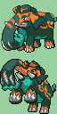
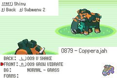

## Sprite Insertion Instructions





in `front_pic_anims.h`:

```diff
-PLACEHOLDER_ANIM_SINGLE_FRAME(Copperajah);
+static const union AnimCmd sAnim_Copperajah_1[] =
+{
+    ANIMCMD_FRAME(1, 20),
+    ANIMCMD_FRAME(0, 20),
+    ANIMCMD_END,
+};
```

Then change `//.frontAnimId = ANIM_V_SQUISH_AND_BOUNCE,`, to any animation you want. I'm using `.frontAnimId = ANIM_V_SQUISH_AND_BOUNCE,` and for the back anim do the same but change it to `.backAnimId = BACK_ANIM_SHRINK_GROW_VIBRATE,`

Lastly, change:

```diff
-const u32 gMonFrontPic_Copperajah[] = INCBIN_U32("graphics/pokemon/gen_8/copperajah/front.4bpp.lz");
+const u32 gMonFrontPic_Copperajah[] = INCBIN_U32("graphics/pokemon/gen_8/copperajah/front_anim.4bpp.lz");
```
