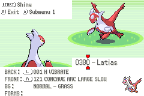

## Sprite Insertion Instructions




in `front_pic_anims.h`:

```diff
-static const union AnimCmd sAnim_Latias_1[] =
-{
-    ANIMCMD_FRAME(0, 10),
-    ANIMCMD_FRAME(1, 10),
-    ANIMCMD_FRAME(0, 10),
-    ANIMCMD_FRAME(1, 10),
-    ANIMCMD_FRAME(0, 10),
-    ANIMCMD_END,
-};
+static const union AnimCmd sAnim_Latias_1[] =
+{
+    ANIMCMD_FRAME(0, 10),
+    ANIMCMD_FRAME(1, 20),
+    ANIMCMD_FRAME(0, 10),
+    ANIMCMD_FRAME(1, 20),
+    ANIMCMD_FRAME(0, 10),
+    ANIMCMD_END,
+};
```
