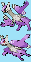

## Sprite Insertion Instructions

Don't forget to also change the palette with this one!





in `front_pic_anims.h`:

```diff
-PLACEHOLDER_ANIM_SINGLE_FRAME(LatiasMega);
+static const union AnimCmd sAnim_LatiasMega_1[] =
+{
+    ANIMCMD_FRAME(0, 10),
+    ANIMCMD_FRAME(1, 20),
+    ANIMCMD_FRAME(0, 10),
+    ANIMCMD_FRAME(1, 20),
+    ANIMCMD_FRAME(0, 10),
+    ANIMCMD_END,
+};
```

Then change `//.frontAnimId = ANIM_V_SQUISH_AND_BOUNCE,`, to any animation you want. I'm using `.frontAnimId = ANIM_CONCAVE_ARC_LARGE_SLOW,`

Lastly, change:

```diff
-const u32 gMonFrontPic_LatiasMega[] = INCBIN_U32("graphics/pokemon/gen_3/latias/mega/front.4bpp.lz")
+const u32 gMonFrontPic_LatiasMega[] = INCBIN_U32("graphics/pokemon/gen_3/latias/mega/front_anim.4bpp.lz");
```
