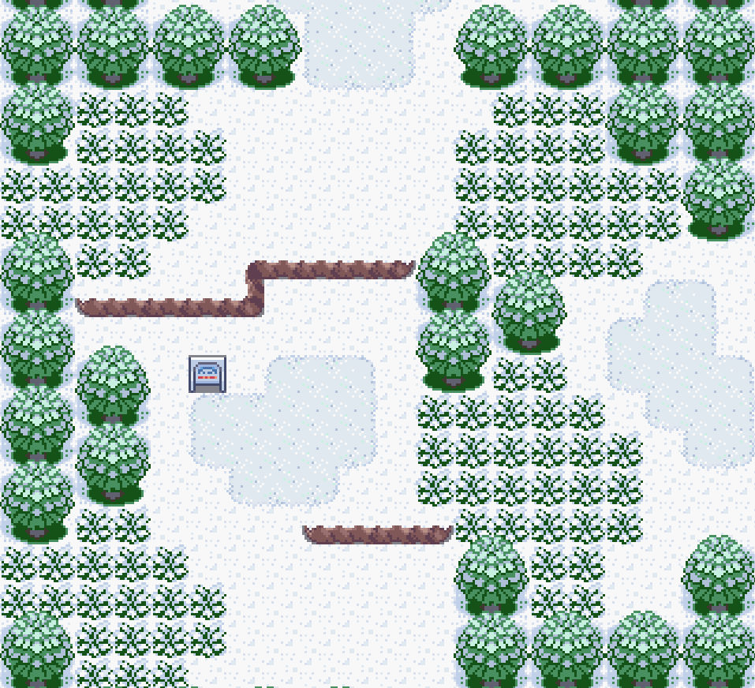

## Primary General Tileset Snow Recolour
- Tileset
- Ryu's winter theme from and palette
- From Archie's Emerald Slide project
- Pawkkie's minor tile and palette changes

## Recommended Use
- Make a new primary tileset in porymap
- Navigate to your primary tileset folder and copy all of the contents of "general" into your new tileset's folder
- Use these three .pal files instead of their corresponding vanilla ones in the new tileset
- This will work just fine out of the box, but for Pawkkie's tile changes you'll also need to import a new tile image, and copy over the metatiles.bin file
- Anyone with a deeper knowledge of tileset insertion is welcome to correct these instructions :)
