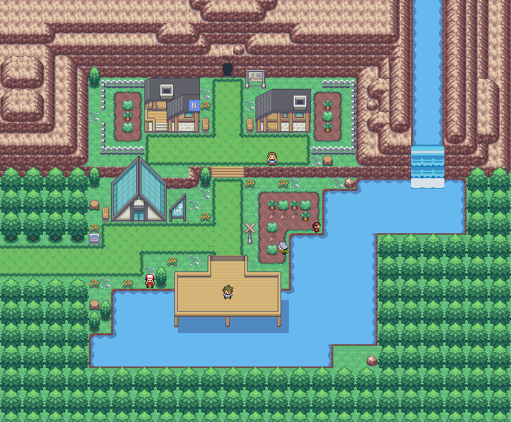
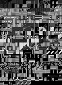

## Small town with lab and parts of train station tiles (secondary)
- Note, the grass tiles are from "Rahtak's greenery" that are used in this tileset, you need to replace them if you use something else
- Please credit all names listed in credits.md for use
- Please also credit Rahtak for the insertable reformat and submission
- Included are also the bottom, middle and top pngs for porytiles usage.

