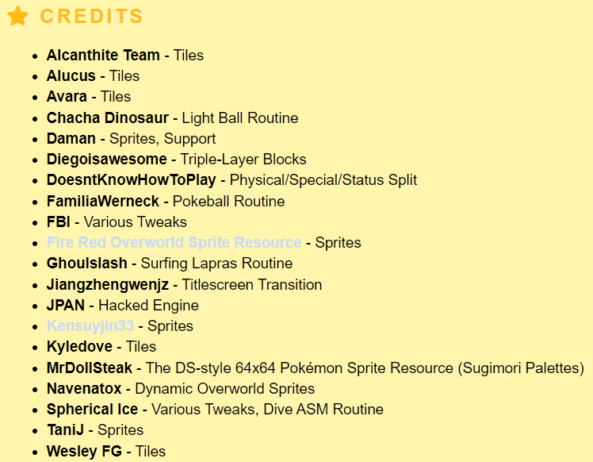

## Valencia Island
- Tileset
- Kalarie's Orange Islands GBA tiles
- Taken with permission
- Tile credits in the [PokeCommunity thread](https://www.pokecommunity.com/threads/pokemon-orange-islands.402242/)
- For pokefirered, but can be used in pokeemerald using [this](https://github.com/ShinyDragonHunter/pokeemerald/commit/b05c124feda40efeb097691412ec79e9afcf3bac) and [this](https://github.com/ShinyDragonHunter/pokeemerald/commit/f1c3c90af995ba3ac9f2818b8016ae20ec487947)
- Credits to ShinyDragonHunter for the pokeemerald metatile implementation
- Pal 7 is used in primary tileset

