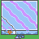

## New Decor
- Individual Tiles
- yoshord

The items in the decoration folder use the palettes of `gTileset_SecretBase` and will slot neatly into that tileset.

| Name | Tiles | Palette | Note |
| --- | --- | --- | --- |
| Polkadot Bed |  | 4 | Two layers |
| Pikachu Bed |  | 3 | Two layers |
| |
| Small Bookshelf |  | 5 | |
| Big Bookshelf |  | 5 | |
| Cupboard |  | 3 | |
| Wood Dresser |  | 5 | |
| Pink Dresser |  | 2 | |
| Refrigerator |  | 4 | |
| Pretty Sink |  | 2 | |
| Bonsai |  | 5 | |
| |
| Makiwara |  | 5 | Whole and cut states |
| Candlestick |  | 1 | Toggle between 'on' and 'off' states |
| Icy Desk |  | 4 | 24 unique tiles |
| |
| Marill TV |  | 1 | |
