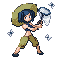
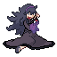
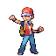

## Palladium Recolours
- Trainer front sprite
- Pawkkie's recolours to get down to 16 colour palettes
- Credit to the Palladium team for the original sprites, see their folder for details

## ORAS Hex Maniac Recolour
- Trainer front sprite
- Pawkkie's recolours to get down to 16 colour palettes
- Credit to KinectedWires for the original sprite

## RSE Red and Leaf Recolours
- RSE changed the back sprite colour of Red and Leaf from FRLG
- This changes the front sprites to match that colour, which also matches the OW sprites

