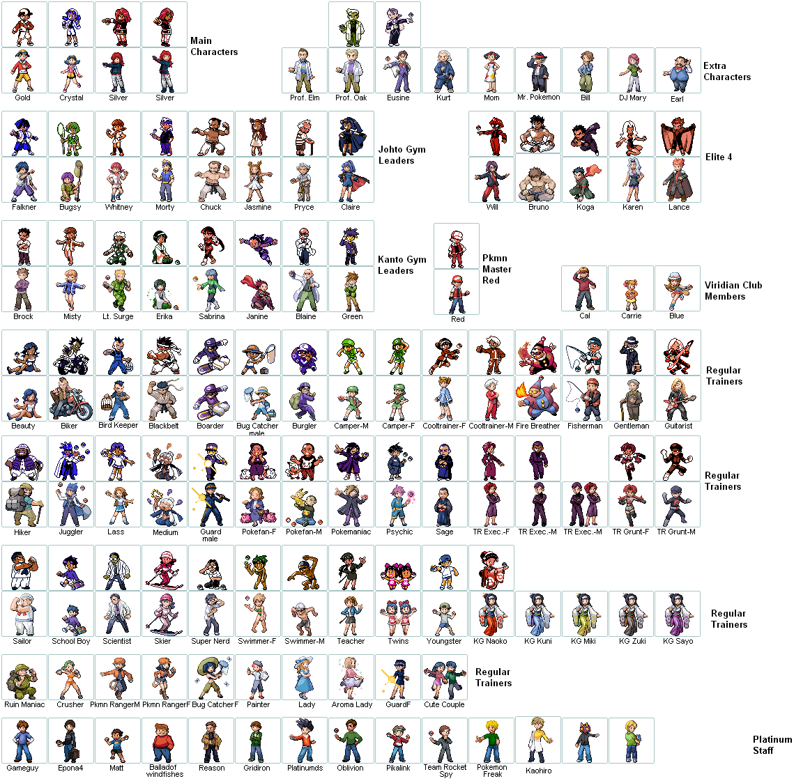

## Project Palladium Asset Resource
- Large variety of assets
- Project Palladium was a GSC remake that was cancelled after HGSS
- The project team release all of their assets to the public for free use
- Initially released [here](http://psc.ramp-it.ca/stuffpds/), which has been a dead URL for some time. Wayback Machine has 1 saved instance in 2018.
- Please credit the entire team for used assets, as this collective decision has been massively beneficial to the community
- Individual credits are supplied with the spritesheets wherever they are known

# Variety of Trainer Front Sprites
- Trainer front sprites
- No individual credits listed, please credit the entire time

