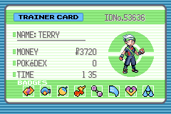

##Colored Badge Sprites




## Implementation
- Drag and drop badges.png and badges.pal into the `trainer_card` folder inside of the `graphics` folder
- Add a new folder inside `trainer_card` called "palettes"
- Place `badges.pal` inside this new folder

In the code, make one change:

```diff
- static const u16 sHoennTrainerCardBadges_Pal[]   = INCBIN_U16("graphics/trainer_card/badges.gbapal");
+ static const u16 sHoennTrainerCardBadges_Pal[]   = INCBIN_U16("graphics/trainer_card/palletes/badges.gbapal");
```
