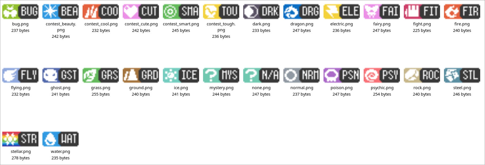

# Lhea's Modern-Styled Type Icons

A set of type icons based on icons made by [Squid Eevee](https://www.spriters-resource.com/custom_edited/pokemoncustoms/sheet/170390/). Includes contest categories.



Note that these icons do ***NOT*** respect the palettes included in `pokeemerald`
and `pokeemerald-expansion` projects by default. If you wish to maintain the
vanilla palettes for any reason, then you can extract these icons to a separate
folder under `graphics` (e.g., `graphics/types_modern`), then make the following
modifications to `graphics_file_rules.mk`:

```diff
TYPESGFXDIR := graphics/types
+TYPESMODERNGFXDIR := graphics/types_modern
RAYQUAZAGFXDIR := graphics/rayquaza_scene
```

```diff
$(TYPESGFXDIR)/move_types.gbapal: $(TYPESGFXDIR)/move_types_1.gbapal \
                                  $(TYPESGFXDIR)/move_types_2.gbapal \
                                  $(TYPESGFXDIR)/move_types_3.gbapal
	@cat $^ >$@

+$(TYPESMODERNGFXDIR)/move_types.4bpp: $(types:%=$(TYPESMODERNGFXDIR)/%.4bpp) $(contest_types:%=$(TYPESMODERNGFXDIR)/contest_%.4bpp)
+	@cat $^ >$@
+
+$(TYPESMODERNGFXDIR)/move_types.gbapal: $(TYPESMODERNGFXDIR)/move_types_1.gbapal \
+                                  $(TYPESMODERNGFXDIR)/move_types_2.gbapal \
+                                  $(TYPESMODERNGFXDIR)/move_types_3.gbapal
+	@cat $^ >$@
+
graphics/bag/menu.4bpp: %.4bpp: %.png
	$(GFX) $< $@ -num_tiles 53 -Wnum_tiles
```

