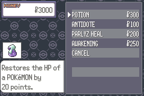

# Mudskip's Vanilla Shop Menu New Tiles

## Summary

- User Interface.
- A modified version of the Shop Menu that uses dark theme colors and has a scrolling bg replacing the overworld view.
  - **WARNING:** Implementing without the scrolling bg is likely possible but you must handle that on your own as this menu is best with the scrolling bg.
- **Please read the Needed Changes section below to properly integrate the graphics here.**
- Asset no longer in use so this is now public and are free to use.
- Credit to Mudskip.



## Needed changes


### NOTE:

- Green text with plus sign (+) means add the line, red text with minus sign (-) means remove the line. The rest is for the context of where the change(s) should be added into. Do not also copy the plus/minus sign when copying/pasting.
  - EX: When copying `+extern const u32 gShopMenu_ScrollGfx[];`, you should only select and copy the `extern const u32 gShopMenu_ScrollGfx[];` part. Same goes for `-    .cursorPal = 2,` to `    .cursorPal = 2,`.

- Make sure to already drag-and-drop the tilesets and the tilemaps into your project's `graphics/shop` folder before doing these.
  - If there's a warning that it'll overwrite existing files, continue overwriting anyway.


### In `include/graphics.h`:

```diff
extern const u32 gShopMenu_Tilemap[];
extern const u32 gShopMenu_Pal[];
+extern const u32 gShopMenu_ScrollGfx[];
+extern const u32 gShopMenu_ScrollTilemap[];

extern const u32 gBattleInterface_BallStatusBarGfx[];
extern const u8 gBattleInterface_BallDisplayGfx[];
```


### In `src/graphics.c`:

```diff
const u32 gShopMenu_Pal[] = INCBIN_U32("graphics/shop/menu.gbapal.lz");
const u32 gShopMenu_Tilemap[] = INCBIN_U32("graphics/shop/menu.bin.lz");
const u32 gShopMenuMoney_Gfx[] = INCBIN_U32("graphics/shop/money.4bpp.lz");
+const u32 gShopMenu_ScrollGfx[] = INCBIN_U32("graphics/shop/scroll.4bpp.lz");
+const u32 gShopMenu_ScrollTilemap[] = INCBIN_U32("graphics/shop/scroll.bin.lz");

// Pokeblock

```


### And lastly, in `src/shop.c`:

#### In `static const struct ListMenuTemplate sShopBuyMenuListTemplate`:

```diff
    .item_X = 8,
    .cursor_X = 0,
    .upText_Y = 1,
-    .cursorPal = 2,
+    .cursorPal = 1,
    .fillValue = 0,
-    .cursorShadowPal = 3,
+    .cursorShadowPal = 2,
    .lettersSpacing = 0,
    .itemVerticalPadding = 0,
    .scrollMultiple = LIST_NO_MULTIPLE_SCROLL,
```

#### In `static const u8 sShopBuyMenuTextColors[][3]`:

```diff
static const u8 sShopBuyMenuTextColors[][3] =
{
    [COLORID_NORMAL]      = {1, 2, 3},
-    [COLORID_ITEM_LIST]   = {0, 2, 3},
-    [COLORID_GRAY_CURSOR] = {0, 3, 2},
+    [COLORID_ITEM_LIST]   = {0, 1, 2},
+    [COLORID_GRAY_CURSOR] = {0, 1, 2},
};
```

#### In `static void VBlankCB_BuyMenu(void)`:

```diff
    LoadOam();
    ProcessSpriteCopyRequests();
    TransferPlttBuffer();
+    ChangeBgY(2, 96, BG_COORD_SUB);
}

static void CB2_InitBuyMenu(void)
```

#### In `static void BuyMenuInitBgs(void)`:

```diff
{
    ResetBgsAndClearDma3BusyFlags(0);
    InitBgsFromTemplates(0, sShopBuyMenuBgTemplates, ARRAY_COUNT(sShopBuyMenuBgTemplates));
-    SetBgTilemapBuffer(1, sShopData->tilemapBuffers[1]);
-    SetBgTilemapBuffer(2, sShopData->tilemapBuffers[3]);
-    SetBgTilemapBuffer(3, sShopData->tilemapBuffers[2]);
+    SetBgTilemapBuffer(1, sShopData->tilemapBuffers[0]);
+    SetBgTilemapBuffer(2, sShopData->tilemapBuffers[1]);
    SetGpuReg(REG_OFFSET_BG0HOFS, 0);
    SetGpuReg(REG_OFFSET_BG0VOFS, 0);
    SetGpuReg(REG_OFFSET_BG1HOFS, 0);
```

### In `static void CB2_InitBuyMenu(void)`:

```diff
    switch (gMain.state)
    {
    case 0:
+        DmaClearLarge16(3, (void *)VRAM, VRAM_SIZE, 0x1000);
        SetVBlankHBlankCallbacksToNull();
        CpuFastFill(0, (void *)OAM, OAM_SIZE);
        ScanlineEffect_Stop();
```

#### In `static void BuyMenuDecompressBgGraphics(void)`:

```diff
static void BuyMenuDecompressBgGraphics(void)
{
-    DecompressAndCopyTileDataToVram(1, gShopMenu_Gfx, 0x3A0, 0x3E3, 0);
+    DecompressAndCopyTileDataToVram(1, gShopMenu_Gfx, 0, 4, 0);
+    DecompressAndCopyTileDataToVram(2, gShopMenu_ScrollGfx, 0, 0, 0);
    LZDecompressWram(gShopMenu_Tilemap, sShopData->tilemapBuffers[0]);
+    LZDecompressWram(gShopMenu_ScrollTilemap, sShopData->tilemapBuffers[1]);
    LoadCompressedPalette(gShopMenu_Pal, BG_PLTT_ID(12), PLTT_SIZE_4BPP);
}
```

#### On `static void BuyMenuDrawGraphics(void)`:

```diff
static void BuyMenuDrawGraphics(void)
{
-    BuyMenuDrawMapGraphics();
-    BuyMenuCopyMenuBgToBg1TilemapBuffer();
    AddMoneyLabelObject(19, 11);
    PrintMoneyAmountInMoneyBoxWithBorder(WIN_MONEY, 1, 13, GetMoney(&gSaveBlock1Ptr->money));
    ScheduleBgCopyTilemapToVram(0);
```

And you're done!
